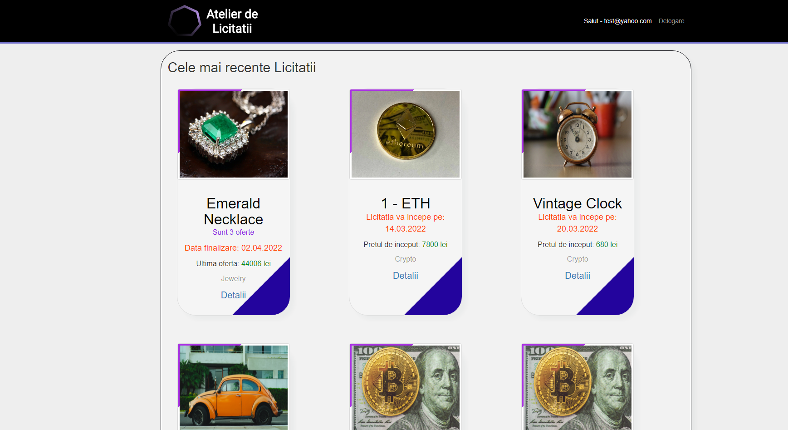
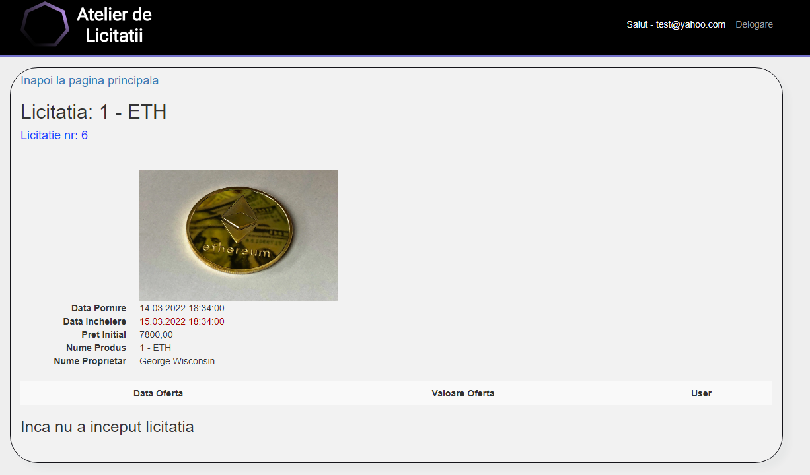

# 👨‍⚖️ Bidding Auction Website
> College project

## General Information
- This website was made for college. I wanted to recreate a real-world auction website.

## 🚀 Local Development
To run this project you need to clone the repository and have installed SQL Server Management to run the db script.

## 🤓 Overiew of functionalities ( - the website is pretty much a CRUD app -)
| Service                             | Technologies                        | Description             |
| ----------------------------------- | ----------------------------------- | ----------------------- |
| Auth                                | C#, SSMS                            | Handles user regristration, logging in, signing out and resetting users passwords  |
| Bids                                | C#, SSMS, ADO.NET, Entity Framework | Handles users placing bids on auction listings  |
| Admin/User                          | C#, SSMS, ADO.NET, Entity Framework | This website have a role user system |
| Adding Products                     | C#, SSMS, ADO.NET, Entity Framework | Expires auction listings once they have ran out of time remaining on the listing |
| Adding Categories of Products       | C#, SSMS, ADO.NET, Entity Framework | Handles serving the website to the user utilizing Server Side Rendering using React with Next.js |
| Listings                            | C#, SSMS, ADO.NET, Entity Framework | Allows admins to create and delete auction listings |
| Payments                            | Stripe                              | Not implemented yet  |

## 👀 Video Example
- This GIF shows how an admin add products, auction items and how a user bids.

- If the auction item have a starting date greater than today, the user will not be able to add bids to that auction.

